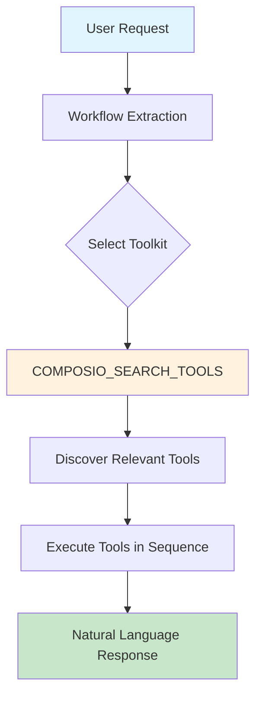
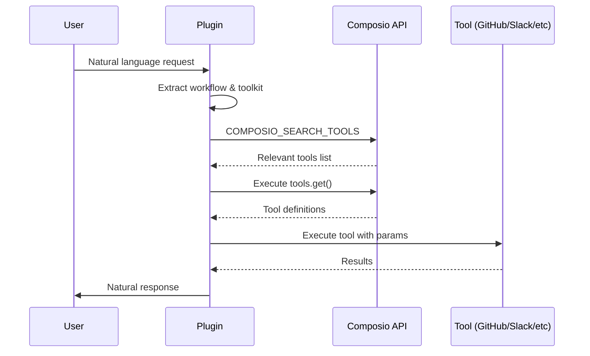

# 🔌 Composio Plugin for ElizaOS

<div align="center">

[](https://www.npmjs.com/package/@standujar/plugin-composio)
[](LICENSE)
[](https://github.com/elizaOS/eliza)

A powerful ElizaOS plugin that integrates **250+ external tool integrations** through [Composio](https://composio.dev). Enable your AI agent to interact with GitHub, Slack, Linear, Google Drive, Notion, and hundreds more services through natural language.

[Features](#features) • [Installation](#installation) • [Configuration](#configuration) • [Usage](#usage) • [API Reference](#api-reference) • [Contributing](#contributing)

</div>

## ✨ Features

- 🔗 **250+ Integrations**: Connect to popular services like GitHub, Slack, Linear, Google Workspace, Notion, Jira, and more
- 🤖 **AI-Powered Tool Selection**: Intelligent semantic search finds the right tools based on natural language requests
- 🔐 **Secure Authentication**: OAuth and API key management handled by Composio
- 🚀 **Zero Configuration**: Works out of the box with connected apps
- 📝 **Vercel AI SDK Integration**: Seamless integration with ElizaOS's function calling
- ⚡ **Smart Workflow Generation**: Automatically creates multi-step workflows from user requests
- 🎯 **Context-Aware**: Understands conversation context for better tool selection

## 📦 Installation

```bash
# Using bun (recommended)
bun add @standujar/plugin-composio

# Using npm
npm install @standujar/plugin-composio

# Using yarn
yarn add @standujar/plugin-composio
```

## ⚙️ Configuration

### Environment Variables

```bash
# Required: Composio API Key
COMPOSIO_API_KEY=your_composio_api_key

# Optional: Default user ID (default: "default")
COMPOSIO_USER_ID=your_user_id

# Optional: Fine-tuning parameters
COMPOSIO_WORKFLOW_EXTRACTION_TEMPERATURE=0.7    # LLM temperature for understanding user intent (default: 0.7)
COMPOSIO_TOOL_EXECUTION_TEMPERATURE=0.1         # LLM temperature for tool execution (default: 0.1)
```

### Character Configuration

Add the plugin to your ElizaOS character configuration:

```json
{
  "name": "MyAssistant",
  "plugins": ["@standujar/plugin-composio"],
  "settings": {
    "secrets": {
      "COMPOSIO_API_KEY": "{{COMPOSIO_API_KEY}}",
      "COMPOSIO_USER_ID": "{{COMPOSIO_USER_ID}}"
    }
  }
}
```

### Getting Started with Composio

1. **Sign up** at [Composio](https://composio.dev)
2. **Generate an API key** from your dashboard
3. **Connect your apps** - Follow the [Quickstart Guide](https://docs.composio.dev/getting-started/quickstart)
4. **Add the API key** to your environment

📚 **Documentation**:
- [Welcome Guide](https://docs.composio.dev/getting-started/welcome)
- [Installation](https://docs.composio.dev/getting-started/installation)
- [Full Documentation](https://docs.composio.dev/)

## 🎯 Usage

The plugin automatically processes natural language requests and executes the appropriate tools through intelligent workflows.

### Example Interactions

#### 📊 Linear Integration - Multi-step Workflow

```
User: Create a new issue in Linear for the project "My Project V1" and assign it to s.andujar
Assistant: I'll create a new issue in Linear for you. Let me handle this step by step...

Workflow executed:
1. LINEAR_LIST_LINEAR_PROJECTS - Find the "My Project V1" project
2. LINEAR_LIST_LINEAR_TEAMS - Get team members to find s.andujar
3. LINEAR_CREATE_LINEAR_ISSUE - Create the issue with all details
4. LINEAR_LIST_LINEAR_ISSUES - Verify the issue was created

✅ Issue created successfully: "New task" assigned to s.andujar in Kenny V1
```

#### 🐙 GitHub Integration - Smart PR Creation

```
User: Create a PR from my feature branch to main with last commits summary
Assistant: I'll analyze your branch and create a comprehensive PR...

Workflow executed:
1. GITHUB_GET_CURRENT_BRANCH - Identify your feature branch
2. GITHUB_LIST_COMMITS - Get recent commits for context
3. GITHUB_COMPARE_BRANCHES - Check differences with main
4. GITHUB_CREATE_PULL_REQUEST - Create PR with auto-generated description

✅ PR #42 created: "Feature: Add user authentication" with 5 commits
```

#### 💬 Slack Integration - Context-Aware Messaging

```
User: Send our standup notes to the team channel
Assistant: I'll format and send the standup notes to your team...

Workflow executed:
1. SLACK_LIST_CHANNELS - Find the appropriate team channel
2. SLACK_GET_CHANNEL_MEMBERS - Verify team members
3. SLACK_SEND_MESSAGE - Send formatted standup notes

✅ Message sent to #team-standup with 12 member mentions
```

### How It Works



### Workflow Intelligence

The plugin understands complex requests and automatically:
- 🔍 **Discovers prerequisites** - Lists projects before creating issues
- 🔗 **Chains operations** - Fetches data needed for subsequent steps  
- ✅ **Verifies results** - Confirms actions completed successfully
- 🧠 **Handles context** - Uses conversation history for better results


## 🛠️ Technical Details

### Architecture



### Key Components

- **ComposioService**: Manages Composio client and tool execution
- **useComposioToolsAction**: Main action handler for tool execution
- **Smart Tool Search**: Semantic search for finding the right tools
- **Vercel AI Integration**: Native support for Vercel AI SDK

## 🔍 Debugging

Enable debug logging to troubleshoot issues:

```bash
LOG_LEVEL=debug bun start
```

Common debug points:
- Workflow extraction from user request
- Tool search results from COMPOSIO_SEARCH_TOOLS
- Tool execution parameters
- Error handling for unconnected apps

## 🤝 Contributing

We welcome contributions! Please see our [Contributing Guide](CONTRIBUTING.md) for details.

### Development Setup

```bash
# Clone the repository
git clone https://github.com/standujar/plugin-composio.git

# Install dependencies
bun install

# Run tests
bun test

# Build the plugin
bun run build

# Run in development mode
bun run dev
```

### Code Style

- TypeScript with strict mode
- ESLint and Prettier for formatting
- JSDoc comments for all public APIs
- Comprehensive error handling

## 📄 License

This plugin is licensed under the MIT License. See [LICENSE](LICENSE) file for details.

## 🆘 Support

- **Documentation**: [Composio Docs](https://docs.composio.dev)
- **ElizaOS**: [ElizaOS GitHub](https://github.com/elizaOS/eliza)
- **Issues**: [GitHub Issues](https://github.com/standujar/plugin-composio/issues)
- **Discord**: Join the ElizaOS Discord community

## 🚀 Roadmap

- [ ] Connect new Apps from Action
- [ ] List Connected Apps from Action
- [ ] Composio Trigger creation from Action

---

<div align="center">
Made with ❤️ by the ElizaOS community
</div>