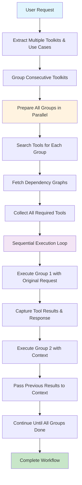
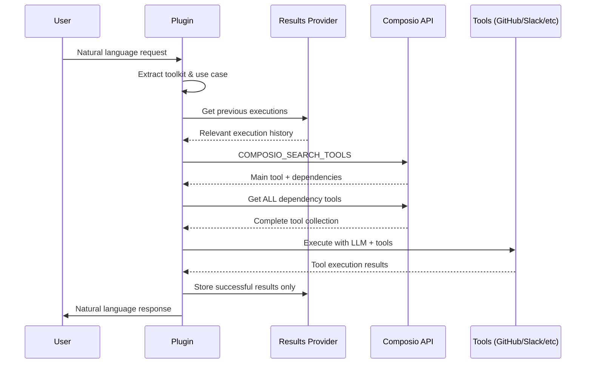

# 🔌 Composio Plugin for ElizaOS

<div align="center">

[](LICENSE)
[](https://github.com/elizaOS/eliza)
[](https://github.com/standujar/plugin-composio/releases/tag/v1.4.0)

A powerful ElizaOS plugin that integrates **250+ external tool integrations** through [Composio](https://composio.dev). Enable your AI agent to interact with GitHub, Slack, Linear, Google Drive, Notion, and hundreds more services through natural language.

[Features](#features) • [Installation](#installation) • [Configuration](#configuration) • [Usage](#usage) • [API Reference](#api-reference) • [Contributing](#contributing)

</div>

## ✨ Features

- 🔗 **250+ Integrations**: Connect to popular services like GitHub, Slack, Linear, Google Workspace, Notion, Jira, and more
- 🤖 **AI-Powered Tool Selection**: Intelligent semantic search finds the right tools based on natural language requests
- 🔐 **Secure Authentication**: OAuth and API key management handled by Composio
- 🚀 **Zero Configuration**: Works out of the box with connected apps
- 📝 **Vercel AI SDK Integration**: Seamless integration with ElizaOS's function calling
- ⚡ **Smart Workflow Generation**: Automatically creates multi-step workflows from user requests
- 🎯 **Context-Aware**: Understands conversation context for better tool selection
- 📊 **Results Provider**: Stores execution results for reuse in subsequent actions
- 🧠 **Intelligent Dependency Resolution**: Only fetches missing data, avoids redundant API calls
- ⚙️ **Smart Context Analysis**: Detects when IDs or data are already available in conversation

## 📦 Installation

```bash
# Using bun (recommended)
bun add @standujar/plugin-composio

# Using npm
npm install @standujar/plugin-composio

# Using yarn
yarn add @standujar/plugin-composio
```

## ⚙️ Configuration

### Environment Variables

```bash
# Required: Composio API Key
COMPOSIO_API_KEY=your_composio_api_key

# Optional: Default user ID (default: "default")
COMPOSIO_DEFAULT_USER_ID=your_user_id

# Optional: Multi-user mode (default: false)
COMPOSIO_MULTI_USER_MODE=false               # false: single user with default ID, true: per-message user ID

# Optional: Restrict available toolkits (default: empty, allows all)
COMPOSIO_ALLOWED_TOOLKITS=gmail,slack,github  # Comma-separated list of allowed toolkit names

# Optional: Fine-tuning parameters (simplified to 3 temperatures)
COMPOSIO_EXTRACTION_TEMPERATURE=0.3   # Precise extraction tasks (default: 0.3)
COMPOSIO_EXECUTION_TEMPERATURE=0.5    # Tool execution workflows (default: 0.5)
COMPOSIO_RESPONSE_TEMPERATURE=0.7     # Natural language responses (default: 0.7)
```

### Character Configuration

Add the plugin to your ElizaOS character configuration:

```json
{
  "name": "MyAssistant",
  "plugins": ["@standujar/plugin-composio"],
  "settings": {
    "COMPOSIO_MULTI_USER_MODE": "{{COMPOSIO_MULTI_USER_MODE}}",
    "secrets": {
      "COMPOSIO_API_KEY": "{{COMPOSIO_API_KEY}}",
      "COMPOSIO_DEFAULT_USER_ID": "{{COMPOSIO_DEFAULT_USER_ID}}"

    }
  }
}
```

### User Modes

The plugin supports two user modes:

#### 🧑‍💼 **Single User Mode** (default: `COMPOSIO_MULTI_USER_MODE=false`)
- Uses the same user ID for all requests (`COMPOSIO_DEFAULT_USER_ID`)
- All users share the same connected apps and data
- Simpler setup, good for personal use or single-tenant scenarios

#### 👥 **Multi-User Mode** (`COMPOSIO_MULTI_USER_MODE=true`)
- Each message sender gets their own user ID (`message.entityId`)
- Isolated app connections and data per user
- Required for multi-tenant applications
- Each user must connect their own apps
- **Execution history isolation**: Results provider maintains separate history per entity

### Toolkit Restrictions

The plugin supports restricting which toolkits users can access via the `COMPOSIO_ALLOWED_TOOLKITS` setting:

#### 🔓 **All Toolkits Mode** (default: `COMPOSIO_ALLOWED_TOOLKITS=""`)
- Users can browse, connect, and disconnect any available toolkit
- Full access to Composio's entire toolkit catalog
- Toolkit discovery uses live API calls

#### 🔒 **Restricted Toolkits Mode** (`COMPOSIO_ALLOWED_TOOLKITS="gmail,slack,github"`)  
- Users can only browse, connect, and disconnect specified toolkits
- Browsing shows only the allowed toolkits (no API call needed)
- Connection/disconnection attempts for non-allowed toolkits are blocked
- Useful for enterprise environments or controlled deployments

### Getting Started with Composio

1. **Sign up** at [Composio](https://composio.dev)
2. **Generate an API key** from your dashboard
3. **Connect your apps** - Follow the [Quickstart Guide](https://docs.composio.dev/getting-started/quickstart)
4. **Add the API key** to your environment

📚 **Documentation**:
- [Welcome Guide](https://docs.composio.dev/getting-started/welcome)
- [Installation](https://docs.composio.dev/getting-started/installation)
- [Full Documentation](https://docs.composio.dev/)

## 🎯 Usage

The plugin provides **5 main actions** to interact with Composio integrations:

### 🔧 Available Actions

#### 1. **Tool Execution** (`executeToolsAction`)
Execute workflows using connected apps based on natural language requests:

```
User: "Create a new issue in Linear and assign it to John"
Assistant: ✅ Created issue LIN-123 in Backend project, assigned to John
```

#### 2. **Browse Available Apps** (`browseToolkitsAction`)
Discover available toolkits by category or functionality:

```
User: "What email apps can I connect with composio ?"
Assistant: Available email apps: Gmail, Outlook, Yahoo Mail, ProtonMail
```

```
User: "Show me project management tools with composio"
Assistant: Available project management tools: Linear, Jira, Asana, Trello, Monday.com
```

#### 3. **Connect Apps** (`connectToolkitAction`)
Connect new integrations to your account:

```
User: "Connect Gmail to my composio account"
Assistant: Gmail connection initiated! Please authorize at: [auth-link]
```

#### 4. **List Connected Apps** (`listConnectedToolkitsAction`)
View all your connected integrations:

```
User: "What apps are my composio connected toolkit?"
Assistant: Your connected apps: Gmail, Slack, Linear, GitHub (4 total)
```

#### 5. **Disconnect Apps** (`disconnectToolkitAction`)
Remove app connections:

```
User: "Remove Slack composio integration"
Assistant: ✅ Slack has been disconnected successfully
```

### Example Interactions

#### 📊 Linear Integration - Smart Dependency Resolution

```
User: Create a new issue in Linear for the project "Backend" and assign it to Alice using composio

[Workflow Analysis]
1. Extract: "Create issue" (linear)
2. Dependencies detected: Need project_id and user_id
3. Combined use case: "List projects and search users. Then, Create issue"

Assistant: I'll create a new issue in Linear. Let me find the project and user first.

✅ Created issue successfully:
- Title: "New task"
- ID: LIN-123  
- Project: Backend
- Assigned to: Alice
- Status: Backlog
- URL: https://linear.app/team/issue/LIN-123
```

#### 🚀 Optimized Workflow - No Dependencies Needed

```
User: Delete issue USEK-162

[Workflow Analysis]
1. Extract: "Delete issue" (linear)
2. Dependencies: None (ID already provided)
3. Final use case: "Delete issue"

Assistant: I'll delete issue USEK-162 for you.

✅ Issue USEK-162 has been successfully archived.
```

#### 💬 Slack Integration - Single Response Mode

```
User: Send a summary of today's standup notes to the team channel
Assistant: I've sent the standup summary to your team channel.

✅ Message posted to #team-standup:
"Daily Standup Summary - January 20
- John: Completed authentication module, starting on API tests
- Sarah: Fixed memory leak issue, reviewing PR #44
- Mike: Updated documentation, working on search optimization
- Blockers: Need design review for dark mode feature"

The message was sent with mentions for all 12 team members.
```

### How Multi-Toolkit Sequential Execution Works

The plugin intelligently handles complex requests that require multiple toolkits by executing them sequentially while passing results between steps:



#### Example: Multi-Toolkit Workflow
```
User: "Get my Linear issues that are In Progress, then send an email summary to john@company.com"

Extraction: 
- Group 1: Linear → ["get issues in progress"]  
- Group 2: Gmail → ["send email summary"]

Phase 1 - Parallel Preparation:
✅ Linear tools fetched (LINEAR_LIST_ISSUES, etc.)
✅ Gmail tools fetched (GMAIL_SEND_EMAIL, etc.)

Phase 2 - Sequential Execution:
Step 1: Linear execution
- Context: "Original request: Get my Linear issues..."
- Current step: "get issues in progress" 
- Result: Found 3 issues (KEN-123, KEN-124, KEN-125)

Step 2: Gmail execution  
- Context: "Original request: Get my Linear issues... 
  Previous step (Linear): Found 3 issues: [{"id":"KEN-123","title":"Plugin Composio"}...]"
- Current step: "send email summary"
- Uses the Linear results to compose the email content
```

### Key Features

- 🎯 **Smart Toolkit Detection** - Automatically identifies the right app from user request
- 🔗 **Sequential Multi-Toolkit Execution** - Handles complex workflows spanning multiple services
- 🧠 **Context-Aware Processing** - Passes results from previous steps to subsequent ones
- ⚡ **Parallel Preparation** - Pre-fetches all required tools simultaneously for optimal performance
- 🔗 **Dependency Resolution** - Includes ALL tool dependencies, lets LLM create intelligent workflows  
- 📊 **Results Provider** - Stores successful execution results for context in future actions
- 🔄 **Multi-User Support** - Works in both single-user and multi-user modes
- 🛡️ **Error Handling** - Retry logic for 500 errors, proper error reporting


## 🛠️ Technical Details

### Architecture



### Key Components

- **ComposioService**: Manages Composio client and tool execution
- **ComposioResultsProvider**: Persistent storage for tool execution results with multi-user isolation
  - Stores up to 5 executions per toolkit per user/entity
  - Enables context-aware subsequent actions
  - Automatically filters successful results
  - Provides execution history for dependency resolution
  - **Multi-user support**: Isolates execution history per entity in multi-user mode
  - **Single-user mode**: Uses default user ID for all executions
- **Actions**:
  - `executeToolsAction`: Main action handler with intelligent dependency resolution
  - `connectToolkitAction`: Connect new apps and integrations
  - `disconnectToolkitAction`: Remove app connections
  - `listConnectedToolkitsAction`: Show connected apps and services
- **Simplified Templates**:
  - `toolExecutionPrompt`: Tool execution with workflow guidance
  - `workflowExtractionPrompt`: Extract toolkits and use cases from requests
  - `toolkitResolutionPrompt`: Resolve toolkit names (extract/select/match)
  - `userResponsePrompt`: Unified response formatting for all user-facing actions
- **Context-Aware Analysis**: Avoids fetching data already in conversation
- **Smart Use Case Combination**: Dependencies execute before main actions

## 🔍 Debugging

Enable debug logging to troubleshoot issues:

```bash
LOG_LEVEL=debug bun start
```

Common debug points:
- Workflow extraction (verb + action format)
- Dependency analysis (what data is missing vs available)
- Use case combination (dependencies + main action)
- Tool search results from COMPOSIO_SEARCH_TOOLS
- Context analysis for avoiding redundant fetches

## 🤝 Contributing

We welcome contributions! Please see our [Contributing Guide](CONTRIBUTING.md) for details.

### Development Setup

```bash
# Clone the repository
git clone https://github.com/standujar/plugin-composio.git

# Install dependencies
bun install

# Run tests
bun test

# Build the plugin
bun run build

# Run in development mode
bun run dev
```

### Code Style

- TypeScript with strict mode
- ESLint and Prettier for formatting
- JSDoc comments for all public APIs
- Comprehensive error handling

## 📄 License

This plugin is licensed under the MIT License. See [LICENSE](LICENSE) file for details.

## 🆘 Support

- **Documentation**: [Composio Docs](https://docs.composio.dev)
- **ElizaOS**: [ElizaOS GitHub](https://github.com/elizaOS/eliza)
- **Issues**: [GitHub Issues](https://github.com/standujar/plugin-composio/issues)
- **Discord**: Join the ElizaOS Discord community

## 📈 Roadmap

- [x] **Connect new Apps from Action** - ✅ Available via `connectToolkitAction`
- [x] **List Connected Apps from Action** - ✅ Available via `listConnectedToolkitsAction`
- [x] **Disconnect Apps from Action** - ✅ Available via `disconnectToolkitAction`
- [ ] Composio Trigger creation from Action
- [ ] Upgrade to latest composio core supporting ai sdk 5

---

<div align="center">
Made with ❤️ by the ElizaOS community
</div>
