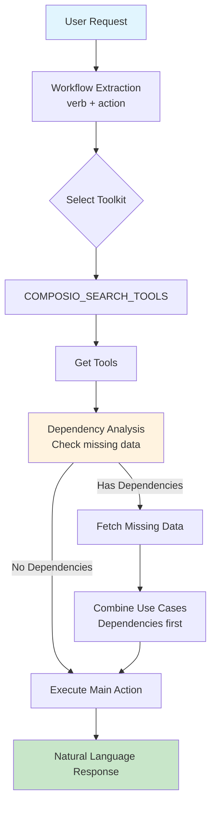
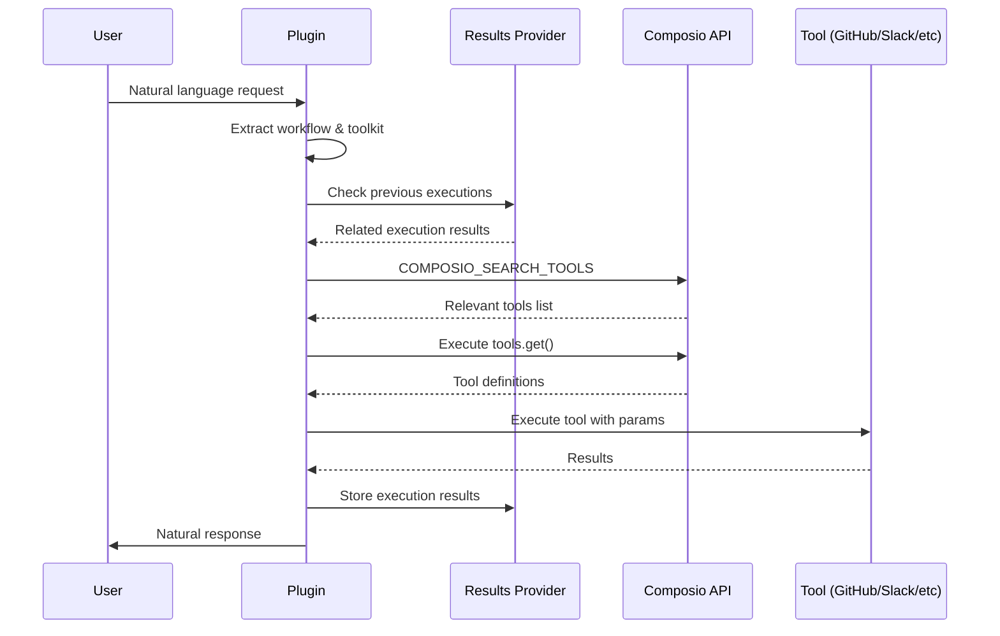

# 🔌 Composio Plugin for ElizaOS

<div align="center">

[](https://www.npmjs.com/package/@standujar/plugin-composio)
[](LICENSE)
[](https://github.com/elizaOS/eliza)
[](https://github.com/standujar/plugin-composio/releases/tag/v1.2.13)

A powerful ElizaOS plugin that integrates **250+ external tool integrations** through [Composio](https://composio.dev). Enable your AI agent to interact with GitHub, Slack, Linear, Google Drive, Notion, and hundreds more services through natural language.

[Features](#features) • [Installation](#installation) • [Configuration](#configuration) • [Usage](#usage) • [API Reference](#api-reference) • [Contributing](#contributing)

</div>

## ✨ Features

- 🔗 **250+ Integrations**: Connect to popular services like GitHub, Slack, Linear, Google Workspace, Notion, Jira, and more
- 🤖 **AI-Powered Tool Selection**: Intelligent semantic search finds the right tools based on natural language requests
- 🔐 **Secure Authentication**: OAuth and API key management handled by Composio
- 🚀 **Zero Configuration**: Works out of the box with connected apps
- 📝 **Vercel AI SDK Integration**: Seamless integration with ElizaOS's function calling
- ⚡ **Smart Workflow Generation**: Automatically creates multi-step workflows from user requests
- 🎯 **Context-Aware**: Understands conversation context for better tool selection
- 📊 **Results Provider**: Stores execution results for reuse in subsequent actions
- 🔄 **Two Execution Modes**: 
  - **Parallel**: Execute multiple tools simultaneously for speed
  - **Sequential**: Step-by-step execution with intermediate feedback
- 💡 **Token Optimization**: 70% reduction in prompt tokens through optimized templates
- 🧠 **Intelligent Dependency Resolution**: Only fetches missing data, avoids redundant API calls
- ⚙️ **Smart Context Analysis**: Detects when IDs or data are already available in conversation

## 📦 Installation

```bash
# Using bun (recommended)
bun add @standujar/plugin-composio

# Using npm
npm install @standujar/plugin-composio

# Using yarn
yarn add @standujar/plugin-composio
```

## ⚙️ Configuration

### Environment Variables

```bash
# Required: Composio API Key
COMPOSIO_API_KEY=your_composio_api_key

# Optional: Default user ID (default: "default")
COMPOSIO_USER_ID=your_user_id

# Optional: Execution mode (default: "parallel")
COMPOSIO_EXECUTION_MODE=parallel    # Options: "parallel" | "sequential"

# Optional: Fine-tuning parameters
COMPOSIO_WORKFLOW_EXTRACTION_TEMPERATURE=0.7    # LLM temperature for understanding user intent (default: 0.7)
COMPOSIO_TOOL_EXECUTION_TEMPERATURE=0.3         # LLM temperature for tool execution (default: 0.3)
```

### Character Configuration

Add the plugin to your ElizaOS character configuration:

```json
{
  "name": "MyAssistant",
  "plugins": ["@standujar/plugin-composio"],
  "settings": {
    "secrets": {
      "COMPOSIO_API_KEY": "{{COMPOSIO_API_KEY}}",
      "COMPOSIO_USER_ID": "{{COMPOSIO_USER_ID}}"
    }
  }
}
```

### Getting Started with Composio

1. **Sign up** at [Composio](https://composio.dev)
2. **Generate an API key** from your dashboard
3. **Connect your apps** - Follow the [Quickstart Guide](https://docs.composio.dev/getting-started/quickstart)
4. **Add the API key** to your environment

📚 **Documentation**:
- [Welcome Guide](https://docs.composio.dev/getting-started/welcome)
- [Installation](https://docs.composio.dev/getting-started/installation)
- [Full Documentation](https://docs.composio.dev/)

## 🎯 Usage

The plugin automatically processes natural language requests and executes the appropriate tools through intelligent workflows. You can choose between two execution modes based on your needs:

### Execution Modes

Set the execution mode via the `COMPOSIO_EXECUTION_MODE` environment variable:

#### 🚀 Parallel Execution (Default)
`COMPOSIO_EXECUTION_MODE=parallel`
- All tools executed in one LLM call
- Single response with complete results
- Lower token usage
- No intermediate updates
- Best for simple or independent tasks

#### 📋 Sequential Execution
`COMPOSIO_EXECUTION_MODE=sequential`
- Step-by-step progress updates
- Intermediate results visible to user
- Context passed between steps
- Best for complex workflows with dependencies

### Example Interactions

#### 📊 Linear Integration - Smart Dependency Resolution

```
User: Create a new issue in Linear for the project "Backend" and assign it to Alice

[Workflow Analysis]
1. Extract: "Create issue" (linear)
2. Dependencies detected: Need project_id and user_id
3. Combined use case: "List projects and search users. Then, Create issue"

Assistant: I'll create a new issue in Linear. Let me find the project and user first.

✅ Created issue successfully:
- Title: "New task"
- ID: LIN-123  
- Project: Backend
- Assigned to: Alice
- Status: Backlog
- URL: https://linear.app/team/issue/LIN-123
```

#### 🚀 Optimized Workflow - No Dependencies Needed

```
User: Delete issue USEK-162

[Workflow Analysis]
1. Extract: "Delete issue" (linear)
2. Dependencies: None (ID already provided)
3. Final use case: "Delete issue"

Assistant: I'll delete issue USEK-162 for you.

✅ Issue USEK-162 has been successfully archived.
```

#### 💬 Slack Integration - Single Response Mode

```
User: Send a summary of today's standup notes to the team channel
Assistant: I've sent the standup summary to your team channel.

✅ Message posted to #team-standup:
"Daily Standup Summary - January 20
- John: Completed authentication module, starting on API tests
- Sarah: Fixed memory leak issue, reviewing PR #44
- Mike: Updated documentation, working on search optimization
- Blockers: Need design review for dark mode feature"

The message was sent with mentions for all 12 team members.
```

### How It Works



### Workflow Intelligence

The plugin uses optimized templates and smart analysis:
- 🎯 **Verb + Action Format** - Simple, clear use case extraction
- 🧠 **Context-Aware Dependencies** - Only fetches data not already in conversation
- ⚡ **Selective Data Fetching** - Skips redundant API calls if IDs are provided
- 🔗 **Smart Use Case Combination** - Dependencies execute before main action
- 📊 **Optimized Templates** - 70% less tokens while maintaining accuracy


## 🛠️ Technical Details

### Architecture



### Key Components

- **ComposioService**: Manages Composio client and tool execution
- **ComposioResultsProvider**: Persistent storage for tool execution results
  - Stores up to 5 executions per toolkit
  - Enables context-aware subsequent actions
  - Automatically filters successful results
  - Provides execution history for dependency resolution
- **useComposioToolsAction**: Main action handler with intelligent dependency resolution
- **useComposioToolsSequentialAction**: Sequential action handler for step-by-step execution
- **Optimized Templates**:
  - `queryExtractionPrompt`: Verb + action extraction (~20 lines)
  - `dependencyAnalysisPrompt`: Smart dependency detection (~25 lines)
  - `contextualPrompt`: Minimal execution prompt (~10 lines)
- **Context-Aware Analysis**: Avoids fetching data already in conversation
- **Smart Use Case Combination**: Dependencies execute before main actions

## 🔍 Debugging

Enable debug logging to troubleshoot issues:

```bash
LOG_LEVEL=debug bun start
```

Common debug points:
- Workflow extraction (verb + action format)
- Dependency analysis (what data is missing vs available)
- Use case combination (dependencies + main action)
- Tool search results from COMPOSIO_SEARCH_TOOLS
- Context analysis for avoiding redundant fetches

## 🤝 Contributing

We welcome contributions! Please see our [Contributing Guide](CONTRIBUTING.md) for details.

### Development Setup

```bash
# Clone the repository
git clone https://github.com/standujar/plugin-composio.git

# Install dependencies
bun install

# Run tests
bun test

# Build the plugin
bun run build

# Run in development mode
bun run dev
```

### Code Style

- TypeScript with strict mode
- ESLint and Prettier for formatting
- JSDoc comments for all public APIs
- Comprehensive error handling

## 📄 License

This plugin is licensed under the MIT License. See [LICENSE](LICENSE) file for details.

## 🆘 Support

- **Documentation**: [Composio Docs](https://docs.composio.dev)
- **ElizaOS**: [ElizaOS GitHub](https://github.com/elizaOS/eliza)
- **Issues**: [GitHub Issues](https://github.com/standujar/plugin-composio/issues)
- **Discord**: Join the ElizaOS Discord community

## 🚀 What's New in v1.2.13

- ⚡ **70% Token Reduction**: Optimized templates from ~100 to ~20 lines
- 🧠 **Smart Context Analysis**: Avoids redundant API calls when data exists
- 🎯 **Selective Dependency Resolution**: Only fetches truly missing data
- 📝 **Verb + Action Format**: Cleaner, more predictable use cases
- 🔄 **Improved Use Case Combination**: Dependencies execute before main action
- 📊 **Results Provider**: New provider system for persistent execution history

## 📈 Roadmap

- [ ] Connect new Apps from Action
- [ ] List Connected Apps from Action
- [ ] Composio Trigger creation from Action
- [ ] Multi-step workflow persistence
- [ ] Parallel dependency resolution

---

<div align="center">
Made with ❤️ by the ElizaOS community
</div>