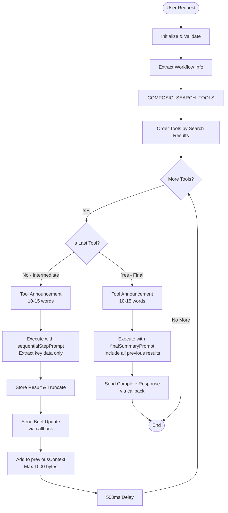

# Composio Plugin Workflows Documentation

This document provides a comprehensive explanation of the two main workflows in the Composio plugin for ElizaOS: `useComposioToolsAction` and `useComposioToolsSequentialAction`.

## Table of Contents

1. [Overview](#overview)
2. [Shared Components](#shared-components)
3. [useComposioToolsAction Workflow](#usecomposiotoolsaction-workflow)
4. [useComposioToolsSequentialAction Workflow](#usecomposiotoolssequentialaction-workflow)
5. [Key Differences](#key-differences)
6. [Token Optimization](#token-optimization)
7. [Error Handling](#error-handling)
8. [Best Practices](#best-practices)

## Overview

The Composio plugin integrates external tools and services into ElizaOS agents, allowing them to perform actions across various platforms (Gmail, Linear, Slack, GitHub, etc.). The plugin provides two main action handlers:

- **`useComposioToolsAction`**: Executes multiple tools in parallel for efficient task completion
- **`useComposioToolsSequentialAction`**: Executes tools one by one with intermediate feedback

## Shared Components

Both actions share several core components:

### 1. Configuration
```typescript
// COMPOSIO_DEFAULTS in config/defaults.ts
{
  WORKFLOW_EXTRACTION_TEMPERATURE: 0.7,  // For understanding user intent
  TOOL_EXECUTION_TEMPERATURE: 0.3,       // For consistent tool execution
  SUMMARY_TEMPERATURE: 0.7,              // For final summaries
}
```

### 2. Type System
```typescript
// Core types used by both actions
interface WorkflowExtractionResponse {
  toolkit: string;      // The app/service to use (e.g., "gmail", "linear")
  use_case: string;     // Natural language description of the task
}

interface ComposioSearchToolsResponse {
  successful: boolean;
  data?: {
    results: Array<{
      tool: string;       // Tool identifier
      description: string; // What the tool does
    }>;
  };
  error?: string;
}

// Model response type handling
interface ModelToolResponse {
  text?: string;
  toolResults?: Array<{ result: unknown }>;
  toolCalls?: Array<{ toolName: string; args: unknown }>;
}
```

### 3. Utility Functions
```typescript
// Shared utilities in utils/helpers.ts
- buildConversationContext(): Extracts recent conversation (last 5 exchanges)
- getAgentResponseStyle(): Gets agent's personality/style directives
- initializeComposioService(): Sets up Composio client and validates connection
- sendErrorCallback(): Standardized error responses
- sendSuccessCallback(): Standardized success responses

// Type utilities in types/model.ts
- extractResponseText(): Prefers text over raw toolResults
- isModelToolResponse(): Type guard for model responses
```

### 4. Templates
```typescript
// Common templates in templates/index.ts
- queryExtractionPrompt: Extracts toolkit and use case from user request
- contextualPrompt: For parallel execution with all tools

// Sequential templates in templates/sequentialStepPrompt.ts
- toolAnnouncementPrompt: Brief status updates (10-15 words)
- sequentialStepPrompt: For intermediate tool execution
- finalSummaryPrompt: For final tool execution with complete formatting
```

## useComposioToolsAction Workflow

This action executes all necessary tools in a single LLM call for maximum efficiency.

### Workflow Diagram

```mermaid
flowchart TD
    Start([User Request]) --> Init[Initialize Composio Service]
    Init --> CheckApps{Connected Apps?}
    
    CheckApps -->|No Apps| Error1[Return Error: No Apps Connected]
    CheckApps -->|Has Apps| Extract[Extract Workflow Info]
    
    Extract --> Parse[Parse Toolkit & Use Case]
    Parse --> ValidateApp{App Connected?}
    
    ValidateApp -->|Not Connected| Error2[Return Error: App Not Connected]
    ValidateApp -->|Connected| Search[COMPOSIO_SEARCH_TOOLS]
    
    Search --> CheckSearch{Search Successful?}
    CheckSearch -->|Failed| Error3[Return Error: Tool Search Failed]
    CheckSearch -->|Success| GetTools[Get Tool Definitions from SDK]
    
    GetTools --> CheckTools{Tools Found?}
    CheckTools -->|No Tools| Error4[Return Error: No Tools Found]
    CheckTools -->|Has Tools| BuildPrompt[Build Contextual Prompt]
    
    BuildPrompt --> Execute[Execute All Tools in Single LLM Call]
    Execute --> ExtractResponse[Extract Response Text]
    
    ExtractResponse --> CheckResponse{Has text?}
    CheckResponse -->|Yes| UseText[Use response.text]
    CheckResponse -->|No| UseToolResults[Use extractResponseText()]
    
    UseText --> Success[Return Success Response]
    UseToolResults --> Success
    
    Error1 --> End([End])
    Error2 --> End
    Error3 --> End
    Error4 --> End
    Success --> End
```

### Key Implementation Details

1. **Single LLM Call**: All tools are passed to one `useModel` call
2. **Response Handling**: 
   - Prefers `response.text` if available (formatted by LLM)
   - Falls back to `extractResponseText()` for raw tool results
3. **Temperature**: 0.3 for consistent execution

## useComposioToolsSequentialAction Workflow

This action executes tools one by one, providing feedback after each step.

### Workflow Diagram



### Step-by-Step Process

1. **Tool Announcement Phase** (All tools)
   ```typescript
   // Uses TEXT_SMALL model for speed
   const announcement = await runtime.useModel(ModelType.TEXT_SMALL, {
     prompt: toolAnnouncementPrompt(...),
     temperature: 0.7
   });
   sendSuccessCallback(callback, announcement.trim());
   ```

2. **Intermediate Tool Execution**
   - Uses `sequentialStepPrompt`
   - Instructions: "BE EXTREMELY CONCISE - Maximum 15 words"
   - Extracts only key data (IDs, names, counts)
   - Truncates results to 500 chars for storage
   - Updates `previousContext` with truncated data (max 1000 bytes)

3. **Final Tool Execution**
   - Uses `finalSummaryPrompt` instead of `sequentialStepPrompt`
   - Receives all previous results via `allResults`
   - Instructions: "Include ALL details... be thorough and well-structured"
   - Sends complete formatted response

4. **Context Flow**
   ```
   Tool 1 → truncated result → previousContext
   Tool 2 → truncated result → previousContext
   ...
   Final Tool → receives all results → complete response
   ```

## Key Differences

| Aspect | Parallel | Sequential |
|--------|----------|------------|
| **LLM Calls** | 2 (extraction + execution) | 2n+1 (extraction + announcements + executions) |
| **User Feedback** | Single final response | Step-by-step updates + final response |
| **Token Usage** | Lower overall | Optimized with truncation |
| **Context Passing** | All tools see full request | Tools see truncated previous results |
| **Final Response** | From single execution | From dedicated summary prompt |
| **Best For** | Independent tools | Dependent workflows |
| **Temperature** | 0.3 (execution) | 0.3 (execution), 0.7 (announcements) |

## Token Optimization

The sequential action implements several strategies to prevent token explosion:

### 1. Result Truncation
```typescript
// Intermediate results truncated for storage
const maxIntermediateSize = 500;
resultForSummary = toolResult.length > maxIntermediateSize
  ? toolResult.substring(0, maxIntermediateSize) + '... [truncated]'
  : toolResult;
```

### 2. Context Truncation
```typescript
// Uses truncate-json library for smart JSON truncation
const maxContextSize = 1000; // bytes
const { jsonString: truncatedResult } = truncateJson(
  JSON.stringify(rawResult), 
  maxContextSize
);
previousContext = `${previousContext}\n${toolName} result: ${truncatedResult}`;
```

### 3. Conversation History
```typescript
// buildConversationContext limits to last 5 exchanges
const recentExchanges = messagePairs.slice(-5);
```

### 4. Strategic Model Selection
- `TEXT_SMALL` for announcements (faster, cheaper)
- `TEXT_LARGE` for execution (more capable)
- `OBJECT_LARGE` for extraction (structured output)

## Error Handling

Both actions implement comprehensive error handling:

### 1. Service Errors
- Service not initialized
- Client not available
- Invalid user ID

### 2. Connection Errors
- No connected apps
- Requested app not connected
- Authentication failures

### 3. Search Errors
- COMPOSIO_SEARCH_TOOLS failures
- No tools found for use case
- Invalid search results

### 4. Execution Errors
- Individual tool failures (sequential continues)
- Empty responses
- Invalid response formats

### 5. Type Safety
```typescript
// Safe type checking prevents runtime errors
if (isModelToolResponse(response) && response.text) {
  // Safe to use response.text
}
```

## Best Practices

### 1. Action Selection
- **Use Parallel** when:
  - Tasks are independent
  - Speed is critical
  - Simple workflows
  - All-or-nothing execution is acceptable
  
- **Use Sequential** when:
  - Tasks depend on previous results
  - User needs progress visibility
  - Complex multi-step workflows
  - Partial success is valuable

### 2. Prompt Engineering
- Keep `use_case` descriptions clear and specific
- Include exact values when known
- Match the language of examples in templates

### 3. Error Messages
- Be specific about what failed
- Suggest next steps
- Maintain agent personality

### 4. Response Formatting
- Always use callback utilities
- Include metadata when helpful
- Preserve agent's style

## Example Scenarios

### Scenario 1: Issue Listing (Parallel)
**User**: "List all Linear issues for project Kenny"

**Flow**:
1. Extract: `toolkit="linear"`, `use_case="list issues for Kenny project"`
2. Search finds: `LINEAR_LIST_LINEAR_PROJECTS`, `LINEAR_LIST_LINEAR_ISSUES`
3. Execute both tools in parallel
4. Return formatted list immediately

### Scenario 2: Issue Creation Workflow (Sequential)
**User**: "Find the Kenny project and create a new bug report"

**Flow**:
1. Extract: `toolkit="linear"`, `use_case="find Kenny project and create bug"`
2. Search finds: `LINEAR_LIST_LINEAR_PROJECTS`, `LINEAR_CREATE_ISSUE`
3. Sequential execution:
   - Step 1: "Finding Linear projects..."
   - Result: "Found project Kenny V1 (ID: 9fbaaf04...)"
   - Step 2: "Creating bug report in Kenny V1..."
   - Final: Complete issue details with ID, URL, etc.

## Conclusion

The Composio plugin provides two complementary approaches to tool execution:
- **Parallel**: Optimized for speed and simplicity
- **Sequential**: Optimized for visibility and complex workflows

Both share robust foundations including type safety, smart token management, and consistent error handling. The choice between them depends on the specific use case and user needs.